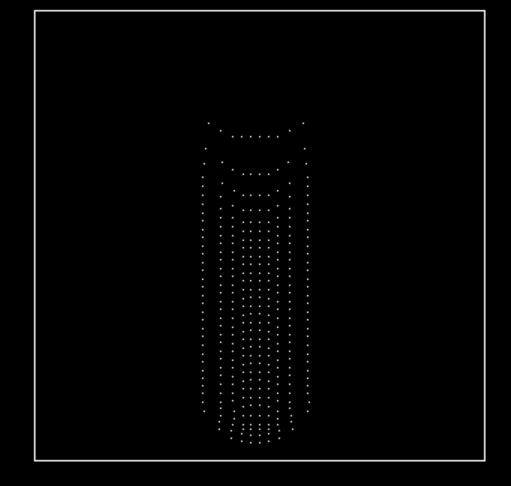
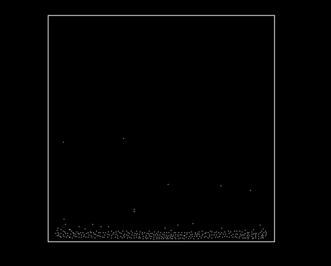

### 基于SPH的2D 流体物理模拟

使用opencv和eigen库实现

实现框架参考GAMES101第一次作业部分opencv实现

需要eigen库和opencv
opencv目录在cmakelists中自行设置
eigen库自行添加库依赖

当前功能：

简单的流体粒子作用模拟

问题：

粒子与刚体边界作用力处理不当

巨低的帧数（也许考虑多线程优化）

反弹作用系数设定优化

当前效果

